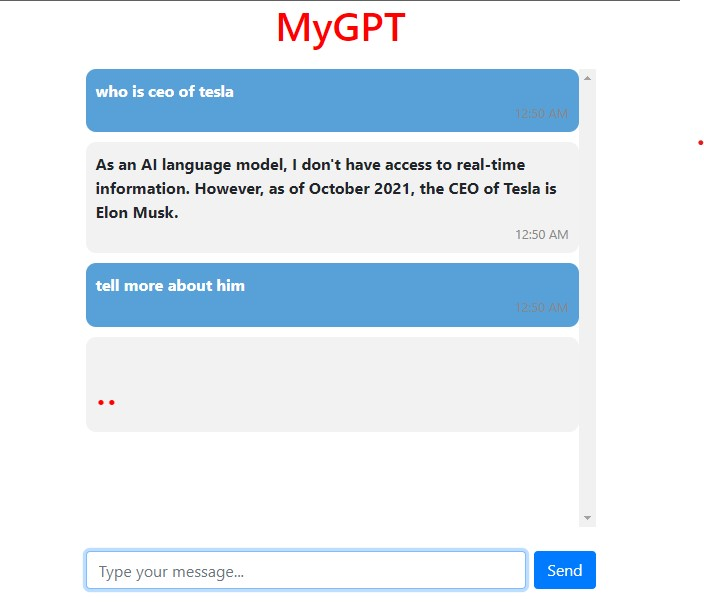

<summary>Install</summary>

```commandline
git clone https://github.com/Muhammedhuseynov/chatgptApi_django

cd chatgptApi_django

pip install -r requirements.txt


```
<summary>Run</summary>

```bash
cd mygpt

Add your openaiKey in .env file

python manage.py runserver
```

<div align="center">


</div>